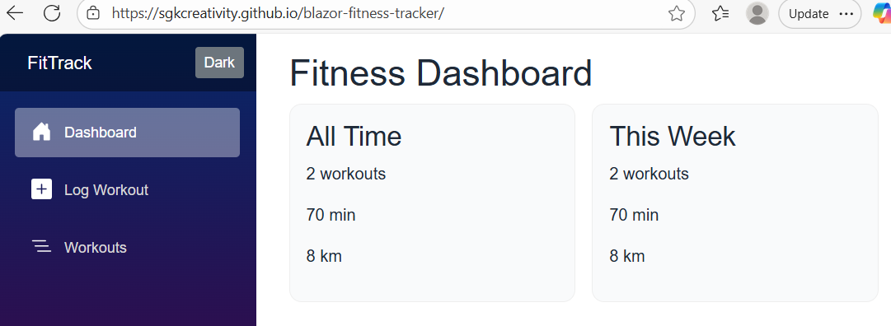
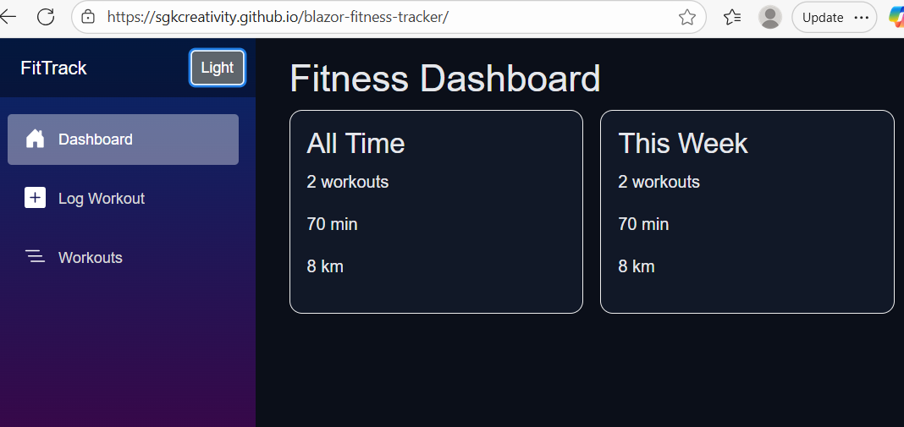
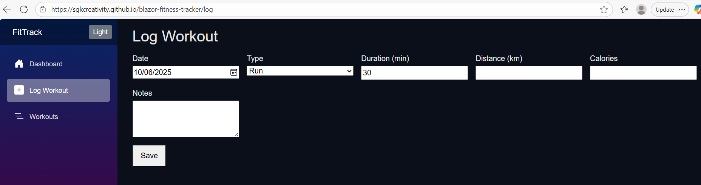
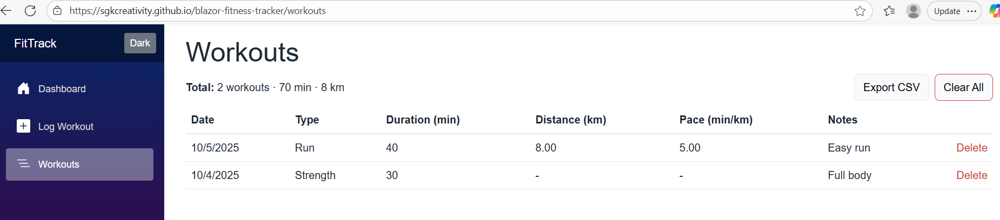

# FitTrack — Blazor WebAssembly Fitness Tracker

[](https://github.com/sgkcreativity/blazor-fitness-tracker/actions/workflows/deploy.yml)
[](#)
[](#license)

**Live Demo:** https://sgkcreativity.github.io/blazor-fitness-tracker/  
**Source:** https://github.com/sgkcreativity/blazor-fitness-tracker

A lightweight fitness tracker built with **Blazor WebAssembly (.NET 8)**. Log workouts, view weekly/overall stats, toggle dark mode, export CSV, and persist data to **LocalStorage**—no backend required. CI/CD is handled via **GitHub Actions** and deployed to **GitHub Pages**.

---

## ✨ Features

- **Log Workouts**: Date, type (Run/Walk/Bike/Swim/Strength/Yoga/Other), duration, distance, calories, notes
- **Stats**: All-time totals + current week summary; pace calculation (min/km)
- **Persistence**: LocalStorage (offline-friendly)
- **Manage Data**: Delete single workout, Clear all, **Export CSV**
- **Dark / Light Mode**: One-click toggle, theme persisted
- **Responsive UI**: Simple, clean, keyboard-friendly
- **Tests**: xUnit for core domain calculations
- **CI/CD**: GitHub Actions → GitHub Pages (SPA fallback enabled)

---

## 🧰 Tech Stack

- **Frontend**: Blazor WebAssembly (.NET 8), Razor Components
- **Language**: C#
- **Styling**: CSS with CSS variables (light/dark)
- **Storage**: LocalStorage via JS interop
- **Build/Deploy**: GitHub Actions → GitHub Pages
- **Tests**: xUnit (domain layer)

---

## 📁 Project Structure
src/
FitTrack.Core/
Models/
Workout.cs
WorkoutType.cs
Services/
WorkoutStats.cs # pure domain helpers (no UI/JS)
FitTrack.Client/
Layout/
MainLayout.razor
NavMenu.razor
Pages/
Index.razor # dashboard
Log.razor # log a workout
Workouts.razor # list + export/delete/clear
Services/
IWorkoutStore.cs
LocalStorageWorkoutStore.cs
InMemoryWorkoutStore.cs # optional for dev/tests
ThemeService.cs
wwwroot/
css/app.css
js/interop.js
tests/
FitTrack.Core.Tests/
WorkoutStatsTests.cs

---

## 🚀 Getting Started (Local)

**Prerequisite**: [.NET 8 SDK](https://dotnet.microsoft.com/download)

```bash
# build & test
dotnet build
dotnet test

# run the client (prints a local URL)
dotnet run --project src/FitTrack.Client/FitTrack.Client.csproj

Open the URL from the console (e.g., http://localhost:5173).
Log a workout on /log, view/manage on /workouts.

Reset data: open DevTools → Application → Local Storage → remove key fittrack.workouts.v1
or run in console: localStorage.removeItem('fittrack.workouts.v1')

---
dotnet test
Covers domain logic (pace, totals). Add more as you expand.

📦 Deployment (GitHub Pages)

Workflow: .github/workflows/deploy.yml

On push to main, the app is published and deployed automatically.

SPA fallback is enabled via 404.html, so deep links like /workouts and /log work on refresh.

<base href> is adjusted during publish for https://sgkcreativity.github.io/blazor-fitness-tracker/.

Live: https://sgkcreativity.github.io/blazor-fitness-tracker/

---
📤 CSV Export

Exports workouts.csv with columns:

Id,Date,Type,DurationMin,DistanceKm,Calories,Notes

Notes are quoted and escaped as needed.

---
🖼️ Screenshots (recommended for recruiters)

Create a docs/img/ folder and add:

docs/img/dashboard-light.png — dashboard, light mode

docs/img/dashboard-dark.png — dashboard, dark mode

docs/img/log-form.png — log workout form

docs/img/workouts-table.png — list view with actions

Then embed them here:





🗺️ Roadmap

Charts (weekly distance/pace)

Edit workouts (inline or modal)

Tags/filters (tempo/interval/long run)

Import from CSV

IndexedDB or server API option

PWA (installable) + offline assets

---
🤝 Contributing

Issues and PRs welcome. Please keep commits descriptive and scoped.


